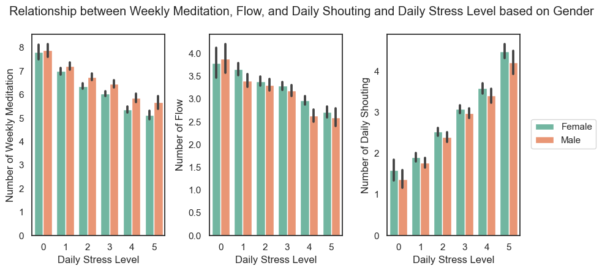

# Group 06 - The effect of different lifestyle factors on human well-being

## Introduction
Our project aims to explore factors nested within five dimensions that contribute to work-life balance. Many strive to achieve an ideal work-life balance but have yet to reach them due to the multifaceted nature of work-life balance itself. One with a poor work-life balance may then be impacted by a wider range of negative outcomes, such as health and life satisfaction. By possessing a deeper understanding of this dataset, we are able to better understand how these factors interact with each other, and how to improve one’s work-life balance overall. The outcomes of this project may have the potential to develop a user-facing dashboard that provides personalized recommendations to individuals seeking to achieve a better work-life balance.

 

## Exploratory Data Analysis
- Most of the columns in this dataset are numeric variables, and there is no missing variable.
- However, there is one incorrectly reported value in the daily stress level column (‘1/1/00’). It needs to be dropped to prevent errors in analysis.
<>
- By plotting a histogram of all factors, we observe work-life balance scores and and sleep hours follow a normal distribution, while some factors are skewed such that they have a distinctively high frequency of values at the higher end of the histogram. These include places visited, supporting others, social network, and personal awards among others
<>
- As for the demographic variables, we have more females than males in our dataset. Among all the age groups, individuals less than 20 are of the least in the dataset.

 

## Research Question 1
### "Overall, does a healthy mind dimension help to maintain low-stress levels? If so, which factors of the healthy mind dimension are related to low-stress levels and how does it differ based on one's demographic information?"

 

This section, it is to analyze the relationship between daily stress levels and the healthy mind dimension in this dataset. This research question will be analyzed into 3 parts: firstly, the relationship between daily stress level and variables in the healthy mind dimension overall, secondly, the relationship between each variable in the healthy mind dimension and daily stress level will be explored to determine the variables with the strongest association, lastly, it is to be investigated how these relationships differ based on one’s demographic information such as gender and age.

 

This box plot is used to see the trend of each daily stress level (0, 1, 2, 3, 4, 5) with an overall healthy mind score. Overall healthy mind score is computed by summing the number of flow, number of weekly meditations, and number of daily shouting, while the number of daily shouting is reverse coded. This plot shows the positive relationship that as daily stress level increases, the average of weighted healthy mind scores increases. It implies that people with a healthy mind are likely to have a low-stress level.  

 

The correlation matrix heat map explains the second part of my research question, the relationship between each variable in the healthy mind dimension and daily stress level. The correlation coefficient r of the relationship between daily stress level and flow is -0.13, of the relationship between daily stress level and weekly meditation is -0.22, and of the relationship between daily stress level and daily shouting is 0.3. This finding can answer the second part of my research question that the number of daily shouting has the strongest association with daily stress level.

 

These graphs show the differences in relationships based on one’s demographic information. First, the relationships based on gender, overall trends are similar both in males and females. In the relationship between the number of weekly meditation and daily stress level, males reported more the number of weekly meditation than females throughout the daily stress levels, while in the relationship between the number of daily shouting and daily stress level, females reported more the number of daily shouting than male through the daily stress levels. In the relationships based on age, the age group of '51 or more' always reported the highest number of weekly meditation level among age groups throughout all daily stress levels in the relationship between the number of weekly meditation and daily stress level, whereas this group reported lowest number of daily shouting throughout all daily stress level in the relationship between the number of daily shouting and the daily stress level.

 

## Research Question 2
### 

 
This section delves further into the demographic factors influencing differences in work-life balance scores. More specifically, the aim of this analysis is to determine the degree to which age and gender contribute to the understanding of which lifestyle factors are most strongly associated with work-life balance scores.

To answer this question, I assessed the distribution of work-life balance scores across gender and age groups, respectively. Based on the findings, the overall shape and distribution of work-life balance scores are relatively similar between the two demographic groups, thus enabling a more robust comparison of correlations within demographic cohorts.

After calculating correlation matrices for each demographic group, correlation heatmaps were plotted for the five lifestyle factors that correlate the highest with work-life balance scores. In general, a consistent pattern emerged which factor persists in the top five across demographic groups: achievement. The following represents the heatmap for gender. For the male group, achievement was the highest correlated factor (r = .60), followed by supporting others and completing tasks on their to-do list (r = .56). By contrast, providing support to others was slightly more strongly correlated with work-life balance for females (r = .53), with achievement closely trailing behind (r = .52).

The following heatmap visualizes the correlations for the age groups. Based on the analysis, achievement remains to be the highest correlated factor for the age groups of those under 20, as well as those aged 21 to 35 and 36 to 50. However, for those over 50, similar emphasis was put on supporting others and achievement (r = .55), with the added emergence of having a clear life vision within the top five correlated factors toward work-life balance scores. Notably, individuals under 20 differed from all other age groups in one factor ‘flow’ as one of the top factors, while all other age groups had ‘time for passion’ as one of their top correlated factors. Despite these small variations, the overall consistency in the ranking of lifestyle factor highlights the importance of these factors in contributing to work-life balance across different demographic groups. Further analysis would be needed to consider whether the small differences in correlation to be significant.

## Research Question 3

## Conclusion
- By investigating research question 1, it can be concluded that variables in healthy mind dimension help to maintain low stress level and among all three variables, the number of daily shouting shows the strongest correlation with daily stress level. Among the relationship between 3 variables, there was no significant gender difference found but some age groups shows higher value than other groups in some relationship.
- Self-sufficient is a major part of self-care in leading a thriving life as shown by the relationship between physical and mental health factors. Motivation to accomplish things in life is driven by being self-sufficient and having more completed task result in lower levels of daily stress showing that having an orderly and productive life do impose less stress in daily life. However, BMI range is not a leading factor affecting daily stress which aligns with some recent research that claimed BMI_RANGE is not a good indicator of a healthy body as lower and higher BMI count can also be unhealthy.
